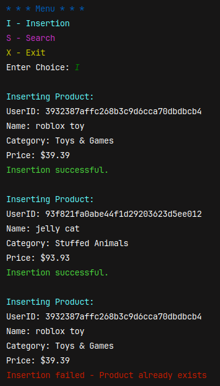
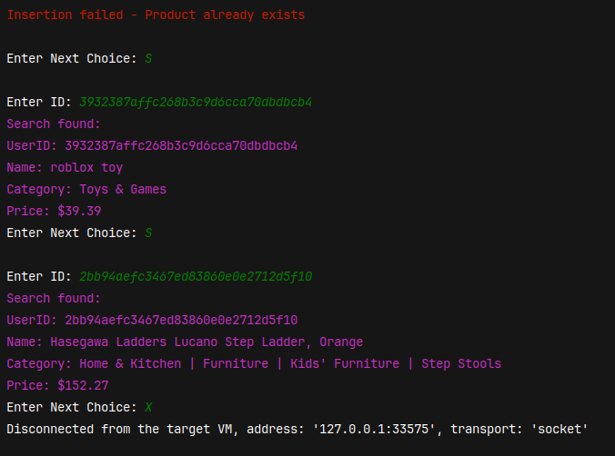

# CS2341 - Assignment 3
- ID: 48051462
- NAME: Mollie Hamman
- Date: 11-17-2024

#                                                         for N=10000
- for both insertion and search:      2log(N)     =>        2log(10000) = 26.5754248
- for insertion:                      log(N)      =>        log(10000)  = 13.2877124
- for search:                         log(N)      =>        log(10000)  = 13.2877124

# Analysis
Once 10,000 products are inserted into a tree, there are roughly 13 levels to it, making insertion or search log(N).
Worst case (being that the product is at the bottom of the tree) is that you have to descend the tree down 13 levels in order to find or insert a product.

# OUTPUT:

